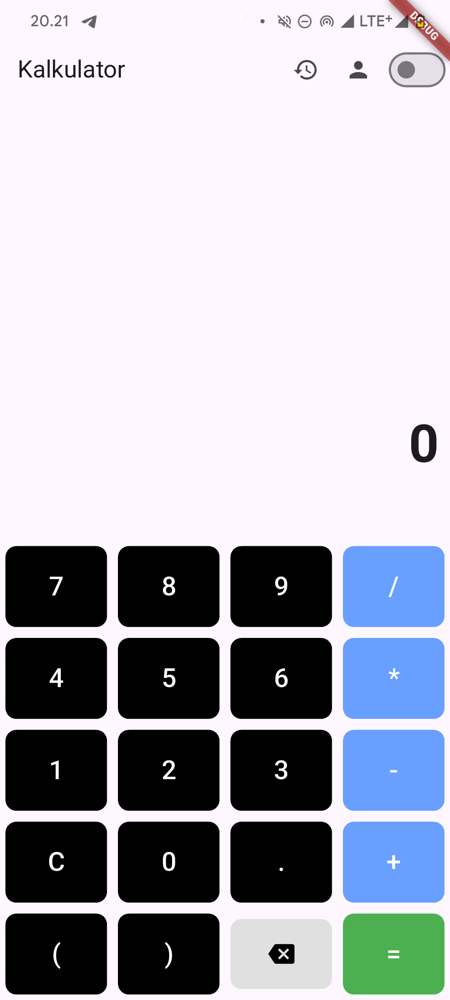

# Flutter Dart Calculator v1  

## Application Description  
Flutter Dart Calculator v1 is a simple calculator application built with Flutter that supports basic operations *(+ , - , * , /)*. In addition to the calculator feature, this app also includes a user profile information page.  

## Application Features  

This application consists of four main features:  

### 1. *Kalkulator*  
- A functional calculator that supports *addition (+), subtraction (-), multiplication (), and division (/).  
- Simple and user-friendly interface.  
- Supports real-time calculations without requiring additional confirmation.  

### 2. *Profil*  
- Displays user profile information, such as *name, email, and profile picture*.  
- Allows users to *edit their profile* directly within the app.  
- Provides application version details and developer credits.  

### 3. *History*  
- Keeps a *record of previous calculations* for user reference.  
- Allows users to clear history if needed.  
- Displays past calculations in an easy-to-read format.  

### 4. *Dark Mode & Light Mode*  
- Users can switch between *Dark Mode and Light Mode* for better visual comfort.  
- The theme selection is automatically saved for future sessions.  
- Both themes ensure a seamless user experience.

## Screenshots  
### 1. Light Page  
  

### 2. Dark Page  


### 3. Profile Page  


### 4. History Page  


## Software Used  
- *Flutter* (Latest version)  
- *Dart* (Latest version)  
- *Android Studio / VS Code* (Editor)  
- *Git* (For version control)  

## Installation Guide  
1. Make sure Flutter is installed on your device. If not, follow the guide here: [Flutter Install Guide](https://docs.flutter.dev/get-started/install)  
2. Clone this repository by running:  
   ```sh
   git clone https://github.com/Ian7672/calculator-flutter-dart-v1.git
